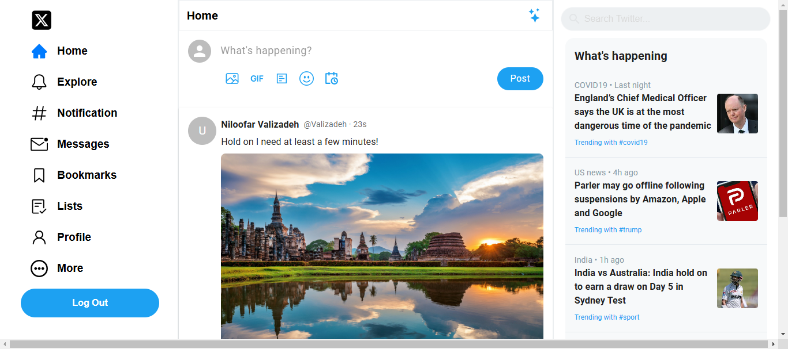
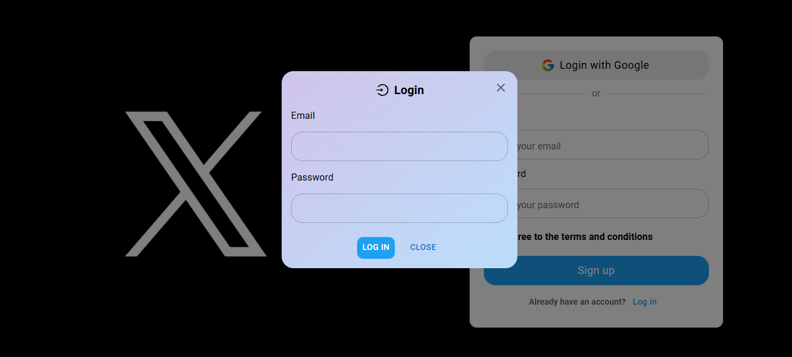
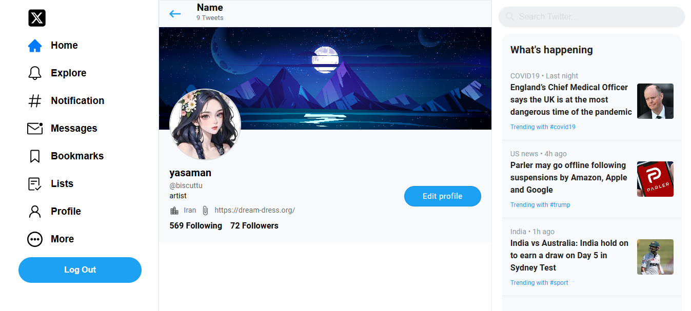
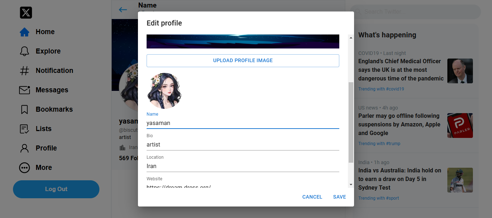

# 🌟 **Twitter Clone Project**

### 🚀 **Overview**

This project is a simple yet functional Twitter clone that replicates key features of the popular social media platform. The aim of this project is to showcase my skills in front-end development using modern technologies.

### ✨ **Features**

✔️ Home Page

✔️ User Authentication (Login & Sign Up)

✔️ Edit Profile

✔️ Profile Picture Selection

### 💻 **Tech Stack**

**🔹 Frontend:**

- React.js

- HTML5

- CSS3

- Tailwind CSS

- Material-UI (MUI)

**🔹 Backend as a Service:**

- Supabase

### 📸 **Screenshots**

### 🏠 Homepage  
  

### 🔑 Login Page  
  

### ✨ Sign-Up Page  
  

### 👤 User Profile  
  

### 🛠 Edit Profile  


### ⚙️ **Getting Started**

1️⃣ Clone the repository:
```bash
git clone https://github.com/username/twitter-clone.git
```
2️⃣ Navigate to the project folder:
```
cd twitter-clone
```
3️⃣ Install dependencies:
```
npm install
```
4️⃣ Run the project:
```
npm start
```
### 🛠️ **Improvements**

In the future, I plan to add the following features:

📝 Add New Tweets
📩 Direct Messaging
🔔 Notifications
🌙 Dark Mode

### 👤 **Author**

🌟 Niloofar Valizadeh

📧 Email: niloofarvalizadeh2@gmail.com


